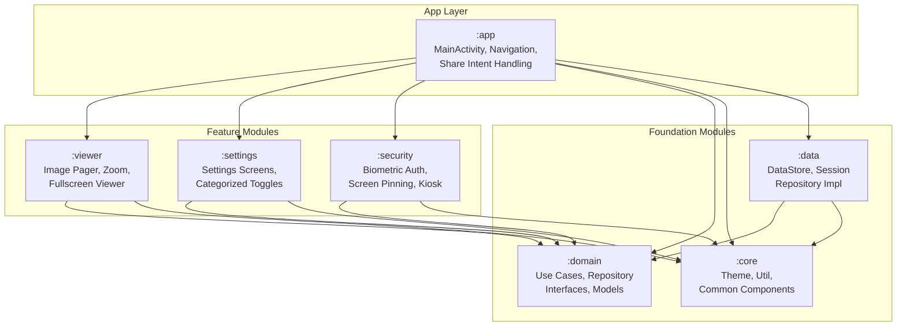

# Guest Gallery — Privacy-First Android Photo Sharing App

[](https://github.com/guestgallery/guest-gallery/actions/workflows/ci.yml)
[](https://github.com/guestgallery/guest-gallery/releases)
[](https://opensource.org/licenses/Apache-2.0)

**Guest Gallery** is a lightweight, secure, and privacy-focused Android application designed for a single purpose: letting you safely hand your phone to someone else for viewing selected photos without exposing the rest of your gallery, notifications, or device.

It is **not** another photo organizer. It is an ephemeral, temporary sandboxed viewer.

---

## 🔒 Philosophy

- **No Albums / Timeline / Folders**: There is no persistence of your library.
- **No Cloud / Login / Sync**: Your photos never leave your device.
- **Zero Internet Permissions**: Engineered without the `INTERNET` permission in `AndroidManifest.xml` so it is physically impossible to leak data.
- **No Ads, Tracking, or Analytics**: Total privacy by design.

---

## 🚀 Workflow

1. **Select Photos**: Open your usual gallery (Google Photos, system gallery, etc.) and select the images you want to share.
2. **Share**: Tap **Share** and choose **Guest Gallery**.
3. **Immersive Lock**: Guest Gallery opens only those selected images, activates secure kiosk mode, hides system bars, and locks screenshot/recording capabilities.
4. **Hand Over**: Hand the phone to your guest. They can only swipe and zoom through those specific photos.
5. **Secure Exit**: To exit, you (the owner) must authenticate via fingerprint or device PIN.

---

## 🛠️ Architecture

Guest Gallery is built using **Clean Architecture**, **MVVM**, and modern Android development best practices.



### Module Breakdown
- `:app`: Application entry point, single Activity host, composition root, and Share Sheet intent handling.
- `:viewer`: Jetpack Compose horizontal image pager incorporating sub-sampled zoom physics (using Coil 3 and Telephoto).
- `:settings`: Material 3 settings interface utilizing a DataStore-backed preference hierarchy.
- `:security`: Interface to BiometricPrompt, window flag controller, screen pinning API, and kiosk mode handlers.
- `:domain`: Pure Kotlin domain abstractions, data models, and business logic use cases.
- `:data`: Implementation of preferences and in-memory session repositories.
- `:core`: Common Jetpack Compose themes (Material 3 Dynamic Theming), spacing constraints, dimensions, and reusable UI nodes.

---

## ⚡ Tech Stack

- **UI & Foundation**: Jetpack Compose, Material 3, Compose Navigation.
- **Image Processing**: Coil 3, Telephoto (for sub-sampling large image zoom physics).
- **Dependency Injection**: Dagger Hilt with KSP.
- **Data & Configuration**: DataStore Preferences.
- **Security Context**: AndroidX Biometric API.
- **Static Analysis**: Detekt, ktlint.

---

## 🛠️ Building & Running

### Prerequisites
- JDK 17 (or higher)
- Android Studio Ladybug (or newer)
- Android SDK 35

### Steps
1. Clone the repository:
   ```bash
   git clone https://github.com/guestgallery/guest-gallery.git
   cd guest-gallery
   ```
2. Download the font files using the setup script:
   ```bash
   ./scripts/download-fonts.sh
   ```
3. Open in Android Studio, sync Gradle, and run on a connected device or emulator.

---

## 📄 License

Guest Gallery is open-source software licensed under the [Apache License 2.0](LICENSE).
