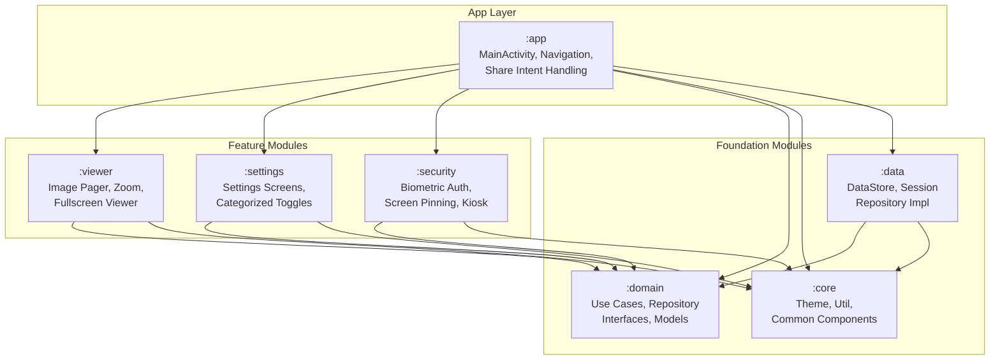

# Architecture Guide

Guest Gallery implements Clean Architecture principles with strict MVVM separation across 7 gradle modules.

## Architecture Map

## Module Responsibilities

### 1. `:domain`
- Contains core data models: `AppSettings`, `ViewingSession`.
- Defines domain contracts (Repository interfaces).
- Exposes single-responsibility Use Cases: `CreateSessionUseCase`, `DestroySessionUseCase`, `GetSettingsUseCase`, `UpdateSettingUseCase`.
- Pure Kotlin code with no Android SDK dependencies.

### 2. `:core`
- Centralized UI styling system (Material 3 components and custom animations).
- Base dimension resources and extensions.
- Contains dynamic layout nodes (such as the premium `AnimatedToggle` and `GlassCard`).

### 3. `:data`
- Backed by AndroidX DataStore for persistent settings.
- Ephemeral in-memory state representation for active viewer sessions.
- Injects repository implementations bound to Domain layer interfaces.

### 4. `:security`
- Enforces biometric authentication checks before permitting exits.
- Modifies Window-level flag parameters (`FLAG_SECURE`, `FLAG_KEEP_SCREEN_ON`).
- Controls screen pinning and immersive layout configurations.

### 5. `:viewer`
- Fullscreen Jetpack Compose view pager interface.
- Utilizes the Telephoto zoom library for advanced panning and double tap triggers.
- Supports slideshow loop controls.

### 6. `:settings`
- Renders the hierarchical settings list (67 configurations across 6 categories).
- Provides toggles and sliders linked to the SettingsRepository.

### 7. `:app`
- Single activity container hosting application navigation.
- Handles parsing incoming share sheet intents (`ACTION_SEND` and `ACTION_SEND_MULTIPLE`).
- Composes the theme wrap over the sub-modules.
